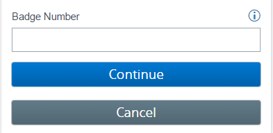
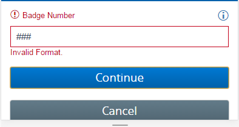
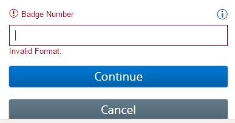
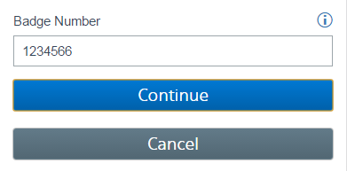

# Sticky Validation - Angular 1.5.7

## Why was this created

Sticky validation is meant to fill the gap in Angular when you only want to show errors on submit, 

and leave those errors displayed even after the user has started changing the input that had the errors. 

Typically in Angular they operate on the concept of dynamic validation. 

This validation evaluates the model in real time and adjusts the error messages accordingly based on user input. 

Once the user has typed something else the original error that caused the problem has been removed automatically by Angular (provided they corrected that original error)

and the model value change has either became valid or possibly still invalid with another validation error occurring. 

With the current implementation of Angular 1.5.7 there was no way to keep the original error and invalid state set once the user fixed 

the problem. From a UX perspective consistency is vital and since we want to operate in the context of only show errors on submit, 

the existing errors should be visible until a submit was again performed.

  
## What is sticky validation

Sticky validation allows you to work with the pre-existing ng-messages/ng-message directives provided by Angular. 

This injects new properties on the form and $error objects to allow for a constant state to be available when displaying error messages

to the user. Sticky validation also operates on the premise that you want to implement "submit" only validation (although nothing is prohibiting sticky state properties from being used with regular validation).

Sticky validation will allow you to preserve the original error message displayed and have a consistent property available indicating 

that "submits" are happening (currently in Angular if you try and use $submitted and $invalid together to show the messages, once $invalid becomes false the messages will hide).

  
## How to implement

Implementing can be done in 3 easy steps, once the directive has been added to your project and registered with your Angular app.

1. Replace any existing ng-submit with se-submit

    <code>

        <form name="cntrl.form" se-submit="cntrl.submit()" novalidate>
    </code>

2. To ensure ng-messages only display when the form is submitted and invalid. Add the following in the ng-if. 

   <b>$fieldInvalid</b> is the custom property added to each element that is kept in sync with Angulars’ $invalid property 

    <code>       

        

            all the ng-message directives

        
        
    </code>

    

3. In your ng-message elements switch the current validation name "required" (Angular implementation) with "stickyrequired"

     <code>                   

        

            Badge Number must be provided

        
        
    </code>

 
  
## Pitfalls

Currently this directive only works for a single level form. If your form has child forms nested within, this will <b>NOT</b> inject 

the custom properties. I have not come across many cases where usage of sub forms is needed, but there are always outliers. 

If child form support is needed please feel free to submit a pull request for review.

  
## Example Walkthrough

1. User comes to page and sees the form to fill out

    

2. User types invalid characters into the form field and clicks "Continue"

    

    The error is displayed in standard Angular fashion

3. With use of sticky validation, once the field is cleared (which sets its state back to valid). the error message and error highlighting remain intact

    

4. User corrects the issue and clicks "Continue" again. That validation issue is then re-evaluated and cleared accordingly.

    

  
## Final Words

I hope this helps in overcoming the pitfalls and gaps with Angular validation when it comes to not wanting dynamic validation on all the time.
One of the great things about this is it still allows you to use Angulars' built in validation for dynamic error messaging.

For more information view

[ng-messages](https://docs.angularjs.org/api/ngMessages)

[angular forms](https://docs.angularjs.org/api/ng/type/form.FormController)

